# 핀테크 프로젝트

<!-- 필수 항목 -->

## 카테고리

| Application | Domain | Language | Framework |
| ---- | ---- | ---- | ---- |
| :white_check_mark: Desktop Web | :white_check_mark: AI | :white_check_mark: JavaScript | :black_square_button: Vue.js |
| :white_check_mark: Mobile Web | :white_check_mark: Big Data | :white_check_mark: TypeScript | :white_check_mark: React |
| :white_check_mark: Responsive Web | :black_square_button: Blockchain | :black_square_button: C/C++ | :black_square_button: Angular |
| :black_square_button: Android App | :black_square_button: IoT | :black_square_button: C# | :white_check_mark: Node.js |
| :black_square_button: iOS App | :black_square_button: AR/VR/Metaverse | :white_check_mark: Python | :black_square_button: Flask/Django |
| :black_square_button: Desktop App | :black_square_button: Game | :white_check_mark: Java | :white_check_mark: Spring/Springboot |

<!-- 필수 항목 -->

<h3> 프로젝트 소개 </h3>
프로젝트 명 : 태산:泰山 절약 저축 플랫폼

* 주요 기능
  - **소비 패턴 분석** : 사용자의 거래내역을 기반으로 소비패턴 분석 결과 제공
  - **샀다 치고** : 충동적인 소비를 억제하고 저축하는 기능
  - **습관 저금** : 소비 습관 개선을 위해 습관을 관리하고 저축하는 기능
  - **절약 챌린지** : 다른 사람들과 일정 기간동안 진행하는 절약 챌린지

* 주요 기술
  * Spring Boot, JPA, QueryDSL, Spring Cloud Config, Spring Security
  * React.js, ReactQuery, TypeScript, Tailwind, PWA
  * FastText, FastAPI, KoNLPy
  * AWS, Nginx, Docker, Jenkins
  * JWT, Redis
  * GitLab, Jira, Figma, Notion
  * Kakao Map API, Naver Clova OCR, Naver Cloud Platform SMS

* 배포 환경
  * URL : https://j9c211.p.ssafy.io

---

## 🚩 목차
[1. 주요 서비스](##-💡-주요-서비스)\
[2. 개발 기간](##-📅-개발-기간)\
[3. 서비스 시연](##-🎪-서비스-시연)\
[4. 팀원 및 역할](##-🤝-팀원-및-역할)\
[5. 주요 기술](##-🛠️-주요-기술)\
[6. 산출물](##-산출물)

# 태산: 泰山(소비 관리 및 저축 플랫폼) :bank:

{: width="800" height=""}

📅 프로젝트 기간 : 2023.08.14 ~ 2023.10.06 (7주)

## [태산:泰山](https://j9c211.p.ssafy.io/):credit_card:
소비 습관으로 이뤄내는 저축! :dollar:

# 태산 기획 :book:

저축은 예금, 적금, 주식, 투자 등 다양한 방식으로 이뤄지고 있습니다. 
하지만 큰 금액으로 꾸준히 해야한다는 부담감이 느껴지곤 합니다. 
사용자의 소비습관 관리를 통해 잘못된 소비 습관을 개선하고 소액으로 저축을 진행하여 부담없이 꾸준히 저축할 수 있는 플랫폼을 기획하게 되었습니다. :smile:

# 태산 소개📄
* 태산은 사용자의 소비 습관을 개선하고 저축 습관을 기를 수 있는 플랫폼입니다!:astonished:
* "소비 패턴 분석" 기능으로 장소, 카테고리 별 소비 패턴을 확인할 수 있습니다! :speech_balloon:
* "샀다 치고" 기능으로 충동구매를 억제할 수 있습니다! :no_entry:
* "습관 저금통" 기능으로 줄이고 싶은 소비를 관리하며 저축이 가능합니다!:lock:
* "절약 챌린지" 기능으로 지인들과 함께 저축 대결이 가능합니다!:family_mmgg:

# 주요 서비스 소개 💡
* 태산의 주요 서비스를 소개합니다!!

## 회원 관련 기능 :man:
|                회원가입                |                 로그인                 |
|:----------------------------------:|:-----------------------------------:|
| 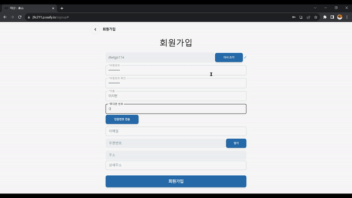 |  | 
|    회원 정보를 입력한 뒤 회원가입을 진행합니다    |         GIF를 이용한 랜딩페이지입니다.          |
* NCP SMS를 이용해 문자 인증을 구현했습니다.
* 카카오 API를 사용하여 주소를 조회했습니다.

## 자산 관련 기능 :moneybag:

제공되는 금융 API가 없기 때문에 자체적으로 카드, 뱅킹 서버를 구축했습니다.

|               자산 연동                |               카드 결제               |
|:----------------------------------:|:------------------------------:|
| 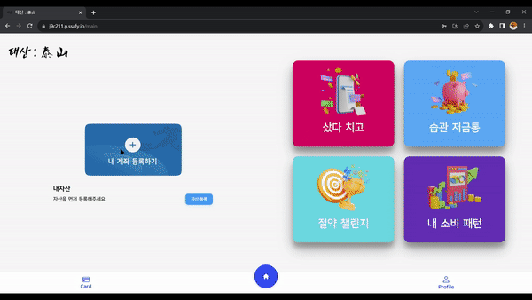 |  |
|     마이데이터 정보 제공에 동의 후 자산을 연동합니다.     | 장소와 가격을 입력한 뒤 결제를 발생합니다.  |

* 자산을 연동하게 되면 랜덤으로 계좌와 카드, 거래내역이 생성됩니다.
* 마이데이터 API request, response를 참고하여 API를 작성했습니다.
  * 실제 마이데이터 API가 제공된다면 바로 서비스에 적용 가능합니다.
* 자체 카드 서버를 이용하여 선택한 카드로 결제를 진행합니다.

|                         카드 결제 내역 조회                          |              상세 결제 내역 조회 / 영수증 등록, 분석               |
|:------------------------------------------------------------:|:-----------------------------------------------:|
|            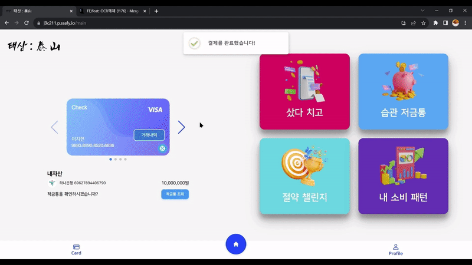             |  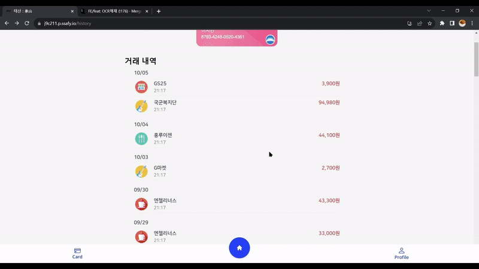 |
| 선택 카드의 결제 내역을 조회합니다. |      결제 내역에 영수증을 등록하고 분석합니다.       |
* 자체 카드 서버에서 발생한 카드내역을 조회합니다.
  * 무한 스크롤을 이용한 페이지네이션을 구현했습니다.
  * 커서 페이지네이션을 이용해 성능을 향상시켰습니다.
* 카드 결제 내역에 대하여 영수증을 등록할 수 있습니다.
  * OCR(Naver Clova)을 통해 영수증 내역을 Text를 추출합니다.
  * 오류 발생을 대비해 추출 내역 수정이 가능합니다.
  * FastText 카테고리 분류 모델을 통해 OCR로 추출한 영수증 내역의 카테고리를 분류합니다.

## 티끌 적금통 :pig2:

* 티끌 적금통은 서비스에서 이용되는 비정기적금 개념의 페이머니입니다.
  * 메인 기능에서 실행되는 저축은 연동 계좌에서 티끌 적금통으로 이뤄집니다.

|              티끌 적금통 생성               |                     티끌 적금통 상세조회 및 해지                      |
|:------------------------------------:|:--------------------------------------------------:|
|  |                | 
|  티끌 적금통을 생성합니다.   | 적금통 상세조회 및 해지가 가능합니다. |

* 실제 적금처럼 기간을 설정한 뒤 생성이 가능합니다.
  * 적금통은 실제 금융 상품을 참고했습니다.
* 적금통에 이체된 내역과 기능별 저축 내역을 조회할 수 있습니다.
* 만기시엔 이율이 적용된 금액을 연동 계좌로 이체합니다.
  * 중도 해지 시엔 감소된 이율을 적용합니다.

## 소비패턴 분석 :shopping_bags:
|                소비 패턴 분석                 |
|:---------------------------------------:|
|   | 
| 소비 패턴 분석 결과를 조회합니다. |

  - 사용자의 거래내역을 분석한 뒤 연도, 월, 분류별로 제공합니다.
  - **Kakao Map API**를 통해 사용자의 거래 내역의 장소를 분류합니다.
  - 결제 내역에 등록한 영수증을 기반으로 상세 내역 분석 결과를 제공합니다.
    * **Naver Clova OCR**을 이용해 영수증 Text 추출을 진행합니다.
    * 추출된 Text를 카테고리 분류 모델에 넣어 카테고리를 분류합니다.

## 샀다치고 :shopping_cart:

충동 구매를 하고 싶은 물품을 샀다고 가정하고 저축하도록 도와주는 기능입니다.

|               샀다치고 물품 등록                |                  샀다치고 물품 조회           |
|:--------------------------------------:|:--------------------------------------:|
| 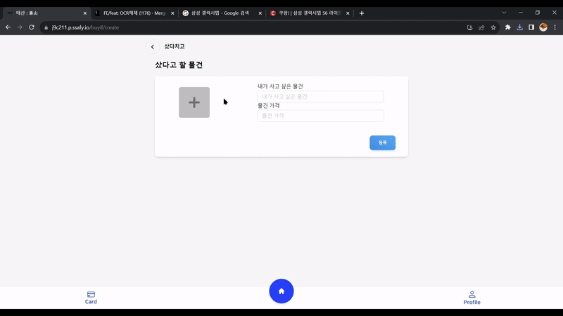 | 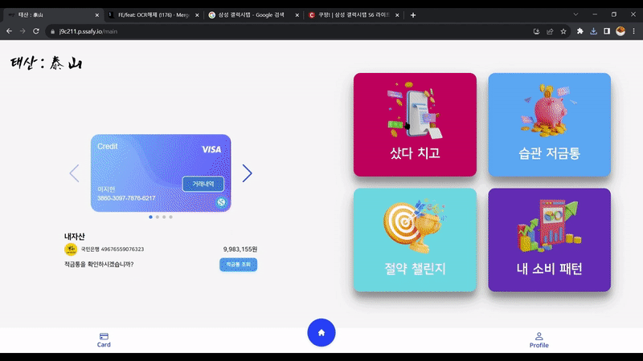 | 
|         샀다치고에 물품을 등록합니다.              |           샀다치고에 등록한 물품을 조회합니다.        |

- 샀다 칠 물건의 이미지, 이름, 가격을 입력하고 등록합니다.
  - 등록된 물건의 가격만큼 연동 계좌에서 티끌 적금통으로 이체가 진행됩니다.
- 지금까지 등록한 물품 목록이 보이고 저축한 가격을 내가 가장 자주 소비한 카테고리로 환산하여 보여줍니다.
  - ex) 갤럭시 버즈 -> 커피 26잔

## 절약 챌린지 :punch:

다른 사람들과 함께 진행하는 챌린지로 "만원의 행복"과 비슷한 기능입니다.

|                절약 챌린지 생성                 |                절약 챌린지 모집                 |
|:----------------------------------------:|:----------------------------------------:|
| 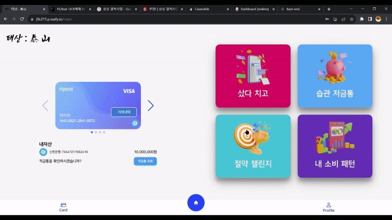 | 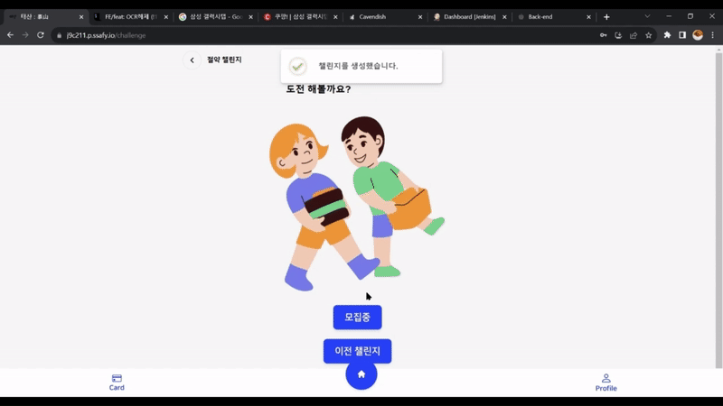 | 
|              절약 챌린지를 생성합니다.              |            절약 챌린지 참가자를 모집합니다.            |

* 설정한 기간동안 목표 금액만큼의 소비하는 챌린지입니다.
* 챌린지 생성 시 만들어진 코드를 입력하여 챌린지에 참여가 가능합니다.
* 실시간으로 참여자 리스트 조회가 가능합니다.

|                절약 챌린지 진행                 |                절약 챌린지 저축                 |
|:----------------------------------------:|:----------------------------------------:|
| 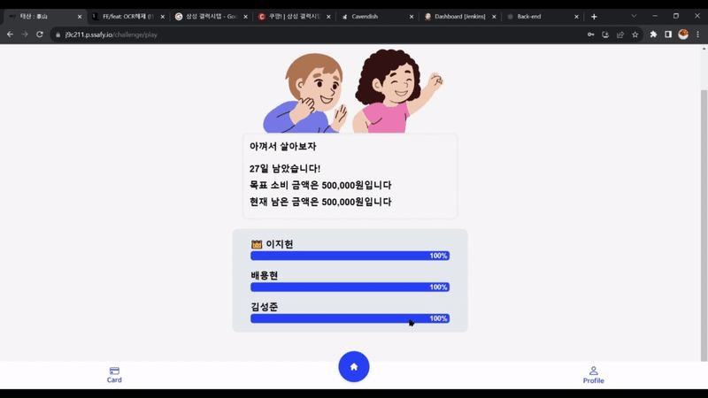 | 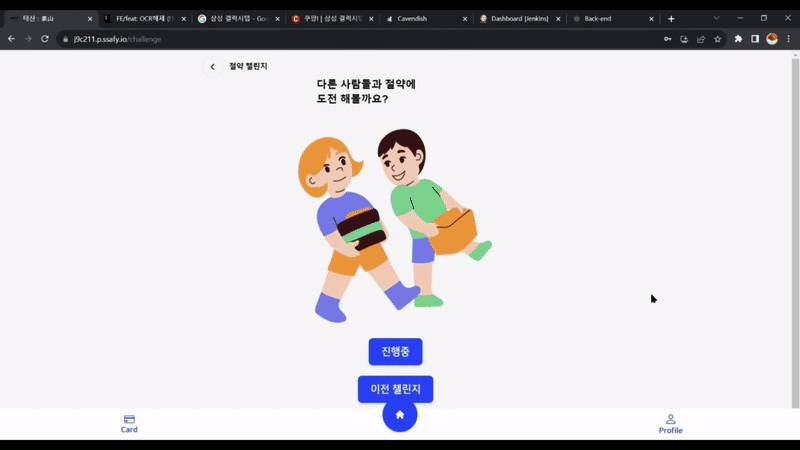 | 
|              절약 챌린지를 진행합니다.              |           절약 챌린지로 아낀 돈을 저축합니다.           |
- 챌린지 생성자가 챌린지 시작을 할 수 있습니다.
- 사용자들마다 결제가 발생하면 자동으로 남은 챌린지 금액이 변동됩니다.
- 종료된 챌린지 목록을 조회할 수 있습니다.
  - 챌린지 종료 시에 남아있는 금액은 티끌 적금통으로 저축이 가능합니다.

## 습관 저금통 :pushpin:

고치고 싶은 소비 습관을 관리하며 저축을 진행하는 기능입니다.

|                  습관 저금 월별조회                  |                 습관 저금통 생성                 |
|:--------------------------------------------:|:----------------------------------------:|
|  | 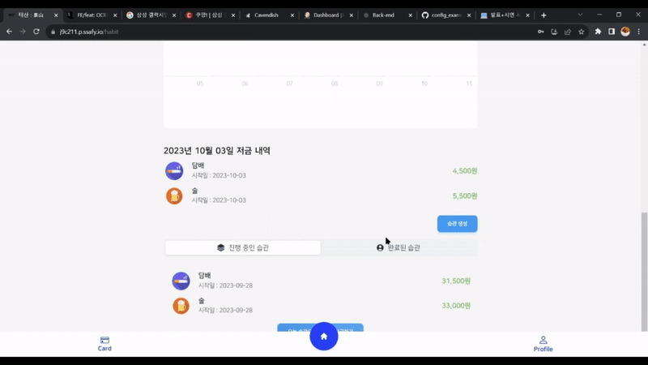 | 
|             습관 저금 내역을 월별로 조회합니다.             |           지킬 지출 습관을 생성합니다.            |

* 달력에 저축한 습관 내역의 금액이 표시됩니다.
  * 월별로 하루 저축 총액이 보이고 선택 시 당일 저축 상세 내역을 볼 수 있습니다.
* 저금통 이름과 진행할 습관을 선택한 뒤 습관 저금통을 생성합니다.
  * 표시되는 습관은 사용자가 지난 한달 간 가장 자주 결제한 장소, 상세 내역을 기반으로 제공됩니다.

|                습관 저금통 상세                 |                 습관 저금통 저금                  |
|:----------------------------------------:|:----------------------------------------:|
| 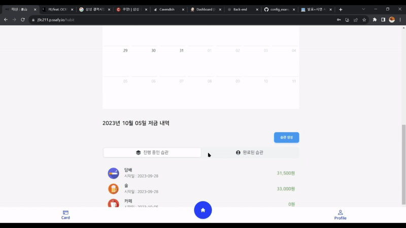 |  | 
|           습관 저금 내역을 상세 조회합니다.            |         습관을 지켜 아낀 내역을 월별로 조회합니다.         |

- 습관을 선택하면 해당 습관에 대해 저축 기록을 월별로 조회할 수 있습니다.
- 당일 습관에 해당하는 결제가 발생하지 않았다면 지난달 해당 습관에 소비한 금액의 하루치(지난달 사용한 총액/30)만큼 저축을 할 수 있습니다.
  - 거래내역에 일치 내역이 있다면 저축이 불가능합니다.
  - 하나의 습관에 대해서 하루에 한 번 저축이 가능합니다.

## 마이페이지 :selfie:
|                 마이페이지 계좌 변경                  |                 마이페이지 내 정보 변경                  |
|:--------------------------------------------:|:----------------------------------------------:|
| 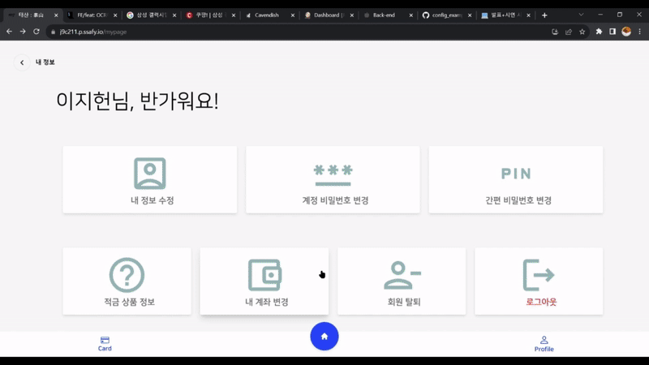 |  | 
|              계정에 등록된 계좌를 변경합니다.              |                 계정의 정보를 변경합니다.                 |

|                  마이페이지 비밀번호 변경                   |                  마이페이지 적금 상품 정보                  |
|:------------------------------------------------:|:------------------------------------------------:|
| 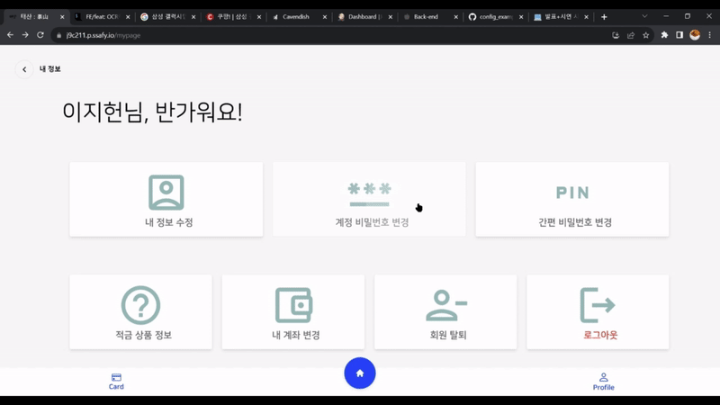 | 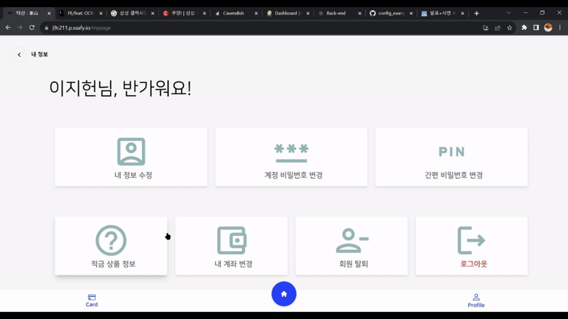 | 
|                 계정의 비밀번호를 변경합니다.                 |               적금 상품의 정보를 확인합니다.               |

|                 마이페이지 회원 탈퇴                  |                  알림                  |
|:--------------------------------------------:|:------------------------------------------------:|
|  | 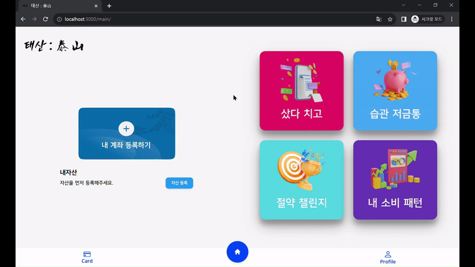 |
|                  계정을 탈퇴합니다.                  |               사용자 및 기능 상태 알림을 표시합니다.               |

* 각 기능들에 대한 상태를 기반으로 알림을 발생합니다.

## 🤝 팀원 및 역할
### 🖌️ FrontEnd
<table align="center">
    <tr align="center">
        <td style="min-width: 150px;">
            <a href="https://github.com/ksungjoon">
              
               
              <b>ksungjoon</b>
            </a>
        </td>
        <td style="min-width: 150px;">
            <a href="https://github.com/PARKHEECHANG">
              
               
              <b>PARKHEECHANG</b>
            </a> 
        </td>
        <td style="min-width: 150px;">
            <a href="https://github.com/heon-2">
              
               
              <b>heon-2</b>
            </a> 
        </td>
    </tr>
    <tr align="center">
        <td>
            김성준
        </td>
        <td>
            박희창
        </td>
        <td>
            이지헌
        </td>
    </tr>
</table>

### 🗄️ BackEnd
<table align="center">
    <tr align="center">
        <td style="min-width: 150px;">
            <a href="https://github.com/bnk159hair">
              
               
              <b>bnk159hair</b>
            </a> 
        </td>
        <td style="min-width: 150px;">
            <a href="https://github.com/byh9811">
              
               
              <b>byh9811</b>
            </a> 
        </td>
        <td style="min-width: 150px;">
            <a href="https://github.com/marugy">
              
               
              <b>marugy</b>
            </a> 
        </td>
    </tr>
    <tr align="center">
        <td>
            김하영
        </td>
        <td>
            배용현
        </td>
        <td>
            신규람
        </td>
    </tr>
</table>

## 🛠️ 주요 기술
### 🔧 BackEnd
Spring Boot, JPA, QueryDSL, Spring Cloud Config, Spring Security
### ⚛️ FrontEnd
React.js, ReactQuery, TypeScript, Tailwind, PWA
### 🧠 AI
FastText, FastAPI, KoNLPy
### ☁️ InfraStructor
AWS, Nginx, Docker, Jenkins
### 🔐 Authencation
JWT, Redis
### 💬 Collaborate
GitLab, Jira, Figma, Notion
### 🌟 Etc
Kakao Map API, Naver Clova OCR, Naver Cloud Platform SMS

## 산출물
### 🏗️ 아키텍쳐 구조도
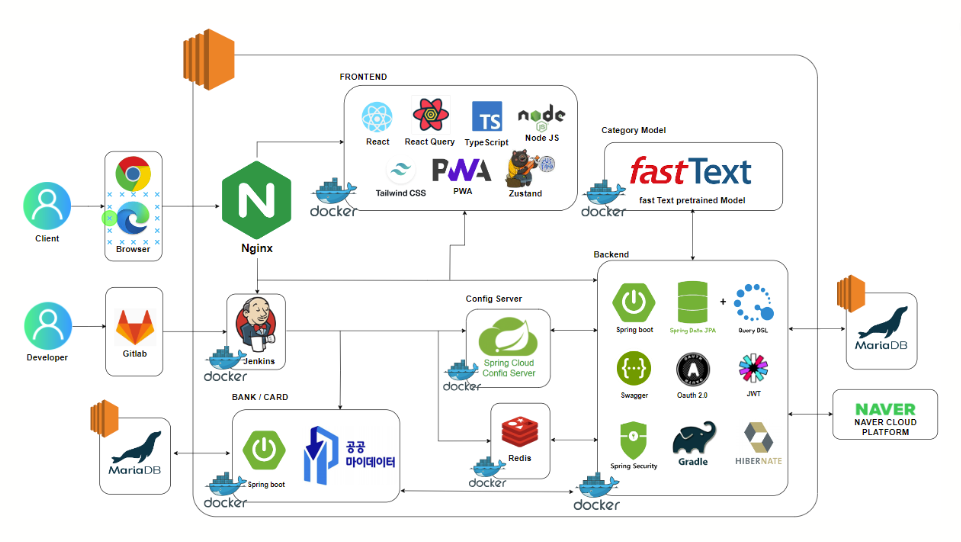

### 🗃️ ERD
{: width="800" height=""}
